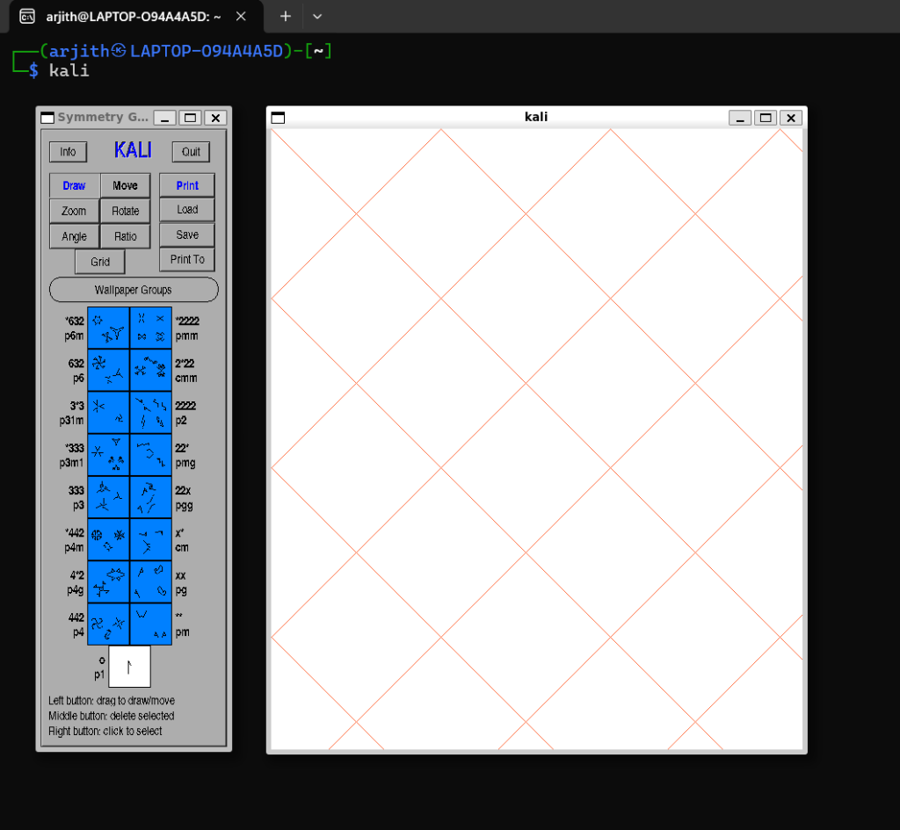
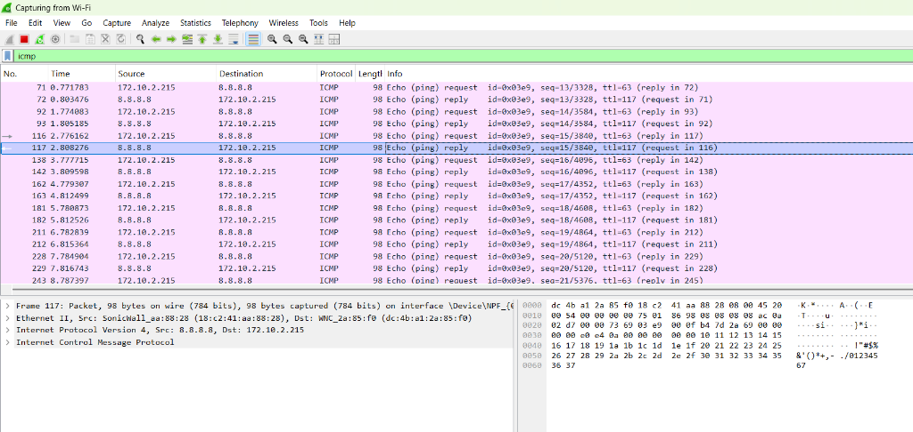

# Cybersecurity Internship - Part 1 Report

## Introduction
This report documents the tasks completed during Part 1 of the Cybersecurity Internship.

## Task 1: Kali Linux Setup
Successfully set up Kali Linux environment.

### Login Screen

### Terminal

## Task 2: Network Analysis
Performed network traffic analysis using Wireshark.

### Wireshark Capture

## Conclusion
All initial setup and analysis tasks have been completed successfully.
